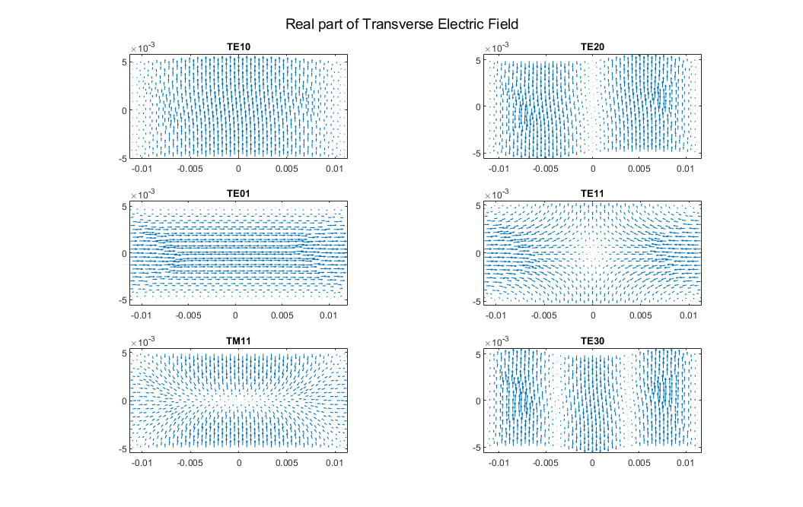

# Project Work 1

## Introduction
In this project, we investigate the electromagnetic modes of a rectangular waveguide using the finite element method (FEM). By starting from Maxwell's equations in a source-free, linear, isotropic, and lossless medium, we derive the strong and weak forms of the governing equations for wave propagation along the waveguide's axis. The analysis separates the fields into transverse and longitudinal components, leading to a mixed formulation involving both scalar nodal and vector edge basis functions. We construct and assemble the FEM matrices $\textbf{A}$, $\textbf{B}$, $\textbf{C}$ and $\textbf{D}$, which respectively represent curl stiffness, mass of the transverse electric field, coupling between transverse and longitudinal fields, and scalar stiffness. A generalized eigenvalue problem is then formulated to compute the propagation constants and corresponding field distributions for the lowest-order waveguide modes.
## Formulation of the Problem
### Strong Form
In a source-free, linear, isotropic, lossless medium, the Maxwell's Equations are as below:

<a id="eq-1"></a>
$$\begin{equation}
    \begin{aligned}
        \nabla \times \textbf{E} &= - i \omega \mu \textbf{H}\\
        \nabla \times \textbf{H} &= i \omega \epsilon \textbf{E}\\
        \nabla \cdot \textbf{E} &= 0\\
        \nabla \cdot \textbf{H} &= 0
    \end{aligned}
\end{equation}$$

Assume a rectangular waveguide aligned along the z-axis:
1.  Infinite in $z$ and bounded in $x$, $y$
2.  Walls are PEC
3.  Fields depend on $x$, $y$ and propagate as $e^{-j \beta z}$

So the fields can be written as

<a id="eq-2"></a>
$$\begin{equation}
    \begin{aligned}
        \textbf{E}(x,y,z) &= \textbf{E}_T(x,y) + \hat{z} E_z(x,y) e^{-j \beta z}\\
        \textbf{H}(x,y,z) &= \textbf{H}_T(x,y) + \hat{z} H_z(x,y) e^{-j \beta z}
    \end{aligned}
\end{equation}$$

Then we substitute [(1)](#eq-1) to [(2)](#eq-2), first Faraday's law:

<a id="eq-3"></a>
$$\begin{equation}
    \begin{aligned}
        &\nabla_T \times \textbf{E}_T + \partial_z E_y \hat{x} - \partial_z E_x \hat{y} = -i \omega \mu (\textbf{H}_T + \hat{z} H_z)\\
        &\nabla_T \times \textbf{E}_T - i \beta \hat{z} \times \textbf{E}_T = -i \omega \mu \textbf{H}\\
        &\textbf{H} = \frac{1}{i \omega \mu} (\nabla_T \times \textbf{E}_T - i \beta \hat{z} \times \textbf{E}_T)
    \end{aligned}
\end{equation}$$

Then we substitute Ampère's law into [(3)](#eq-3) to eleminate $\textbf{H}$, and it gives vector Helmholtz equation as below：

<a id="eq-4"></a>
$$\begin{equation}
    \nabla \times (\frac{1}{\mu_r} \nabla \times \textbf{E}) = k_0^2 \epsilon_r \textbf{E}
\end{equation}$$

By spliting [(4)](#eq-4) into transverse components and longitudinal components, we have the strong form of the transversal components

<a id="eq-5"></a>
$$\begin{equation}
    \nabla_T  \times \frac{1}{\mu_r} \nabla_T \times \textbf{E}_T - i \beta \hat{z} \times \frac{1}{\mu_r} \hat{z} \times \nabla_T E_z - \beta^2 \hat{z} \times \frac{1}{\mu_r} \hat{z} \times \textbf{E}_T - k_0^2 \epsilon_r \textbf{E}_T = 0
\end{equation}$$

and the strong form of the longitudinal component

<a id="eq-6"></a>
$$\begin{equation}
    - \nabla_T \times \frac{1}{\mu_r} \hat{z} \times \nabla_T E_z + i \beta \hat{z} \times \frac{1}{\mu_r} \hat{z} \times \textbf{E}_T - k_0^2 \epsilon_r E_z \hat{z} = 0
\end{equation}$$

### Weak form
We multiply [(5)](#eq-5) by test function $\omega \in V$ and integrate over domain $\Omega$:

<a id="eq-7"></a>
$$\begin{equation}
    \begin{aligned}
            \int_\Omega \textbf{w} \cdot \nabla_T  \times \frac{1}{\mu_r} \nabla_T \times \textbf{E}_T dA &- i \beta \int_\Omega \frac{1}{\mu_r} \textbf{w} \cdot \hat{z} \times \hat{z} \times \nabla_T E_z dA\\
             &- \beta^2 \int_\Omega \frac{1}{\mu_r} \textbf{w} \cdot \hat{z} \times \hat{z} \times \textbf{E}_T dA\\
             &- k_0^2 \int_\Omega \epsilon_r \textbf{w} \cdot \textbf{E}_T dA = 0
    \end{aligned}
\end{equation}$$

By applying Gauss's Law and PEC boundary condition

<a id="eq-8"></a>
$$\begin{equation}
    \begin{aligned}
            \int_\Omega \frac{1}{\mu_r} (\nabla_T \times \textbf{w}) \cdot (\nabla_T \times \textbf{E}_T) &+ i \beta \int_\Omega \frac{1}{\mu_r} (\hat{z} \times \textbf{w}) \cdot (\hat{z} \times \nabla_T  \textbf{E}_T) dA\\
             &+ \beta^2 \int_\Omega \frac{1}{\mu_r} (\hat{z} \times \textbf{w}) \cdot (\hat{z} \times \textbf{E}_T)\\
             &- k_0^2 \int_\Omega \epsilon_r \textbf{w} \cdot \textbf{E}_T dA = 0
    \end{aligned}
\end{equation}$$

The longitudinal component $E_z$ is expanded with scalar linear nodal basis functions:

<a id="eq-9"></a>
$$\begin{equation}
    E_z(x,y) \approx \sum_{n=1}^{\hat{N}_N}{c_n^z u_n(x,y)}
\end{equation}$$

where $\hat{N}_N$ is the number of interior nodes, and the transverse component $\textbf{E}_T$ is expanded with curl conforming edge basis functions:

<a if="eq-10"></a>
$$\begin{equation}
    \textbf{E}_T(x,y) \approx \sum_{n=1}^{\hat{N}_E}{c_n^t \textbf{u}_n^{curl}(x,y)}
\end{equation}$$

where $\hat{N}_E$ is the number of interior edges.

The weak form of the transverse equation is

<a id="eq-11"></a>
$$\begin{equation}
    \textbf{A} \textbf{x}^t + i \beta \textbf{C} \textbf{x}^z + \beta^2 \textbf{B} \textbf{x}^t = 0
\end{equation}$$

where $\textbf{x}^t = [c_1^t, c_2^t,\cdots,c_{\hat{N}_N}^t]$ and $\textbf{x}^t = [c_1^t, c_2^t,\cdots,c_{\hat{N}_N}^t]$ and 

<a id="eq-12"></a>
$$\begin{equation}
    \begin{aligned}
        A(m,n) &= \int_\Omega \frac{1}{\mu_r} (\nabla_T \times \textbf{u}_m^{curl}) \cdot (\nabla_T \times \textbf{u}_n^{curl}) dA - k_0^2 \int_\Omega \epsilon_r \textbf{u}_m^{curl} \cdot \textbf{u}_n^{curl} dA\\
        C(m,n) &= \int_\Omega \frac{1}{\mu_r} (\hat{z} \times \textbf{u}_m^{curl}) \cdot (\hat{z} \times \nabla_T u_n) dA = \int_\Omega \frac{1}{\mu_r} \textbf{u}_m^{curl} \cdot \nabla_T u_n dA\\
        B(m,n) &= \int_\Omega \frac{1}{\mu_r} (\hat{z} \times \textbf{u}_m^{curl}) \cdot (\hat{z} \times \textbf{u}_n^{curl}) dA = \int_\Omega \frac{1}{\mu_r} \textbf{u}_m^{curl} \cdot \textbf{u}_n^{curl}
    \end{aligned}
\end{equation}$$

We test the longitudinal equation with a function $v(x,y) \hat{z}$, we hava

<a id="eq-13"></a>
$$\begin{equation}
    \begin{aligned}
        &\int_\Omega \frac{1}{\mu_r} (\hat{z} \times \nabla_T v) \cdot (\hat{z} \times \nabla_T E_z) dA - \\
        &i\beta \int_\Omega \frac{1}{\mu_r} (\hat{z} \times \nabla_T v) \cdot (\hat{z} \times \textbf{E}_T) dA - k_0^2 \int_\Omega \epsilon_r  v E_z = 0
    \end{aligned}
\end{equation}$$

We define a new matrix

<a id="eq-14"></a>
$$\begin{equation}
    \begin{aligned}
        D(m,n) &= \int_\Omega \frac{1}{\mu_r} (\hat{z} \times \nabla_T u_m) \cdot (\hat{z} \times \nabla_T u_n) dA - k_0^2 \int_\Omega \epsilon_r u_m u_n dA\\
        &= \int_\Omega \frac{1}{\mu_r} \nabla_T u_m \cdot \nabla_T u_n dA - k_0^2 \int_\Omega \epsilon_r u_m u_n dA
    \end{aligned}
\end{equation}$$

So we get an eigenvalue equation as below

<a id="eq-15"></a>
$$\begin{equation}
    \left[ \begin{matrix}
	\mathbf{A}&		0\\
	0&		\mathbf{D}\\
\end{matrix} \right] \left[ \begin{array}{c}
	\mathbf{x}^t\\
	\mathbf{x}^z\\
\end{array} \right] =i\beta \left[ \begin{matrix}
	0&		-\mathbf{C}\\
	\mathbf{C}^T&		0\\
\end{matrix} \right] \left[ \begin{array}{c}
	\mathbf{x}^t\\
	\mathbf{x}^z\\
\end{array} \right] +\beta ^2\left[ \begin{matrix}
	-\mathbf{B}&		0\\
	0&		0\\
\end{matrix} \right] \left[ \begin{array}{c}
	\mathbf{x}^t\\
	\mathbf{x}^z\\
\end{array} \right]
\end{equation}$$

For $\textbf{x}^z$, we can solve from [(15)](#eq-15)

<a id="eq-16"></a>
$$\begin{equation}
    \textbf{x}^z = i \beta \textbf{D}^{-1} \textbf{C}^T \textbf{x}^T
\end{equation}$$

Substituing [(16)](#eq-16) into [(15)](#eq-15) we have

<a id="eq-17"></a>
$$\begin{equation}
    \textbf{A} \textbf{x}^T = \gamma \textbf{M} \textbf{x}^T
\end{equation}$$

where $\textbf{M} = \textbf{B} - \textbf{C} \textbf{D}^{-1} \textbf{C}$

Here is a summary of these matrices except $\textbf{M}$

|Matrix|Physical Effect|Size|Basis Functions|
|---|---|---|---|
|$\textbf{A}$|Curl stiffness|$N_E \times N_E$|Edge-based|
|$\textbf{B}$|Masss of electric field|$N_E \times N_E$|Edge-based|
|$\textbf{C}$|Coupling to longitudianl components|$N_E \times N_N$|Edge-based and nodes-based|
|$\textbf{D}$|Scalar stiffness|$N_N \times N_N$|Nodes-based|

## FEM Solutions
To compute matrices $\textbf{A}$, $\textbf{B}$, $\textbf{C}$ and $\textbf{D}$, we need to calculate these local matrices in each mesh triangle:

<a id="eq-18"></a>
$$\begin{equation}
    \begin{aligned}
        \textbf{alok1}(i,j) &= \int_T N_i(x,y) N_j(x,y) dx dy\\
        \textbf{alok2}(i,j) &= \int_T \nabla N_i(x,y) \nabla N_j(x,y) dx dy\\
        \textbf{alok3}(i,j) &= \int_T \textbf{w}_i(x,y) \cdot \textbf{w}_j(x,y) dx dy\\
        \textbf{alok4}(i,j) &= \int_T (\nabla \times \textbf{w}_i(x,y)) \cdot (\nabla \times \textbf{w}_j(x,y)) dx dy\\
        \textbf{alok6}(i,j) &= \int_T \textbf{w}_i(x,y) \cdot \nabla N_j(x,y) dx dy
    \end{aligned}
\end{equation}$$

### Local Matrices
#### alok1
From [(18)](#eq-18), we know that $alok1(i,j)$ measures  how much the field value at node $j$ contributes to the field value at node $i$ over the element. It encodes the mass of the field at each node(how field energy is stored locally).

#### alok2
Here **g** is the gradient of shape functions. From [(18)](#eq-18), we know that $alok2(i,j)$ measures how the gradients of shape functions interact. It is related to Laplacian operators and appears in Helholtz equation($- \nabla^2 u + k^2 u =0$). It encodes how field variation between nodes contributes to the stored or dissipated energy in the system.

#### alok3
$\textbf{alok3}$ is the mass matrix for the vector finite elements. The elements of $\textbf{alok3}$ appears in $\int \textbf{E}_T \cdot \textbf{w} dA$, representing field energy associated with edge basis functions.

#### alok4
Since $\lambda_j$ is affine, and in 1st-order Nédélec elements $\nabla \lambda_j$ is constant. the dot product $\textbf{w}_i \cdot \textbf{w}_j$ is constant. Then the product is scaled the constant by the area to integrate over the triangle. So the final matrix $\textbf{alok4}$ is a constant.

#### alok6
$\textbf{alok6}$ is the local divergence coupling matrix. It links the transverse vector field $\textbf{E}_T$ with the longitudinal scalar field $E_z$. The former one is represented by the edge basis functions and the later one is represented by nodal basis functions.

### FEM matrices computation
$s(i)$ and $s(j)$ is are sign corrections based on local edge orientation. The code $edges(n) == 0$ and $nodes(n) == 0$ are used to ensure only interior DoF(Degree of Freedom)s are ensembled to avoid assigning values to fixed Dirichlet DoFs and keep the system symmetric and correct for eigenvalue solvers.

The meaaning of these four matrices is
|Matrix|Meaning|
|---|---|
|A|Stores both rotational stiffness and field energy|
|B|Represents $\int \textbf{E}_T \cdot \textbf{w}$|
|C| links vector basis to scalar basis, needed for divergence or longitudinal coupling|
|D|used to eliminate $E_z$ from the system|

### Eigenvalue Problem
With these four matrices, we can solve the waveguide eigenvalue problem using the transverse-longitudinal finite element formulation and computes the lowest 6 waveguide modes.
#### Constants
```MATLAB
c0 = physconst('LightSpeed');
lambda0 = c0 / f0;
k0 = 2 * pi / lambda0;   % wave number at f0
```
We solve for modes around this frequency, and use $k_0$ to compute $f_c$. Here matrices $\textbf{A}$, $\textbf{B}$, $\textbf{C}$ and $\textbf{D}$ depends on $f_0$ numerically but the eigenvalue problem structure and the physical cutoff frequency are fundamentally independent of $f_0$. Matrices $\textbf{A}$ and $\textbf{D}$ include terms that depend on $k_0$ and therefore $f_0$ as [(19)](#eq-19) shows.

<a id="eq-19"></a>
$$\begin{equation}
    \begin{aligned}
        \textbf{A} &= stiffness - k_0^2 \cdot mass\\
        \textbf{D} &= stiffness - k_0^2 \cdot mass
    \end{aligned}
\end{equation}$$

But the problem is a shifted eigenvalue probvlem, structured as

<a id="eq-20"></a>
$$\begin{equation}
    \textbf{A} (k_0) \cdot \textbf{x}_T = \gamma \cdot \textbf{M} \cdot \textbf{x}_T
\end{equation}$$

And [(20)](#eq-20) actually is

<a id="eq-21"></a>
$$\begin{equation}
    (stiffness - k_0^2 \cdot mass) \cdot x = \gamma \cdot (mass - coupling \;\; terms) \cdot x
\end{equation}$$

so $f_0$ serves as a numerical shift, not a constraint. It doesn't limit which modes are found, just shifts the eigenvalues. If $f_0 < min(f_c)$, the all the propagation constant $\beta$ are imaginary, which means all the modes become evanescent, so at $f_0$ all modes are not excited. But we can still computes all $\beta$ and extract correct $f_c$.

#### Extracting Eigenvalues and Computing Cut-off Frequencies
```MATLAB
gamma_all = diag(eigD);
[gamma_sorted, idx] = sort(gamma_all, 'ascend');
gamma_selected = gamma_sorted(1:6);
beta = sqrt(-gamma_selected);
fc = sqrt(k0^2 - beta.^2) * c0 / (2*pi);
```
Here we take 6 smallest $\beta^2$ values to compute the 6 lowest modes.

####  Reconstructing Eigenvectors (Compute $\textbf{E}_T$)
```MATLAB
xET_sel = eigV(:, idx(1:6));  % 6 transverse eigenmodes
```
Each column is a mode for $\textbf{E}_T$.

#### Computing $E_z$ From $\textbf{E}_T$
```MATLAB
xEZ_sel(:, i) = 1i * beta(i) * (Dii \ (Cii.' * xET_sel(:, i)));
```
#### Extending Solutions
```MATLAB
xET = zeros(length(edges), 6);
xET(int_edges, :) = xET_sel;

xEZ = zeros(length(nodes), 6);
xEZ(int_nodes, :) = xEZ_sel;
```
Boundary DoFs are zero, so only interior are filled.

### Computing Fields
We have modal coefficients for $\textbf{E}_T$ and $E_z$, so we can calculate all the fields based on these coefficients.

#### Electric Fields
```MATLAB
ET = s(1)*xETj(eids(1)) * F1(xi, eta) + ...
    s(2)*xETj(eids(2)) * F2(xi, eta) + ...
    s(3)*xETj(eids(3)) * F3(xi, eta);
    
EZ = sum(xEzj(coord_indice))/3;
```
$\textbf{E}_T$ is reconstructed by linear combination of edge functions and $E_z$ is interpolated at barycenter of each mesh triangle.

#### Magnetic Fields
Based on Maxwell's equations in frequency domain:

<a id="eq-22"></a>
$$\begin{equation}
    \textbf{H} = \frac{1}{i \omega \mu_0} \nabla \times \textbf{E}
\end{equation}$$

##### Longitudinal

<a id="eq-23"></a>
$$\begin{equation}
    H_z = \frac{1}{i \omega u_0} (\frac{\partial E_y}{\partial x} - \frac{\partial E_x}{\partial y})
\end{equation}$$

It can be approximated by
```MATLAB
HZ = (gradN2(1)*ET(2) - gradN1(2)*ET(1)) / (1i * omega * mu0);
```

##### Transverse
<a id="eq-24"></a>
$$\begin{equation}
    \textbf{H}_T = \frac{1}{i \omega \mu_0}(i \beta \hat{z} \times \textbf{E}_T - \hat{z} \times \nabla_T E_z)
\end{equation}$$

which is implemented as
```MATLAB
ez_cross_ET = [-ET(2); ET(1)];
gradEz = sum(xEzj .* gradNi);
ez_cross_gradEz = [-gradEz(2); gradEz(1)];
HT = (1i*betaj*ez_cross_ET - ez_cross_gradEz) / (1i * omega * mu0);
```

## Numerical Results

### Cut-off Frequency
The lowest six modes' cut-off freuqncies are as below. The unit is *GHz*.

|Mode|Analytical|Numerical|
|---|---|---|
|$TE_{10}$|6.5571|6.5573|
|$TE_{20}$|13.1143|13.1154|
|$TE_{01}$|14.7536|14.7531|
|$TE_{11}$|16.1451|16.1450|
|$TM_{11}$|16.1451|16.1806|
|$TE_{30}$|19.6714|19.6746|

We can see that the numerical results correspond to analytical ones.

### Field Plots

This is the quiver plots of transverse electric field, we can see their oscillation pattern correspond to the modes.

## Conclusion
Using the transverse-longitudinal finite element formulation, we successfully computed the cutoff frequencies and field profiles of the lowest six modes in a rectangular waveguide. The numerical results show excellent agreement with analytical solutions, validating the accuracy of the FEM implementation. The reconstructed electric and magnetic field plots further confirm the correct identification of each mode.