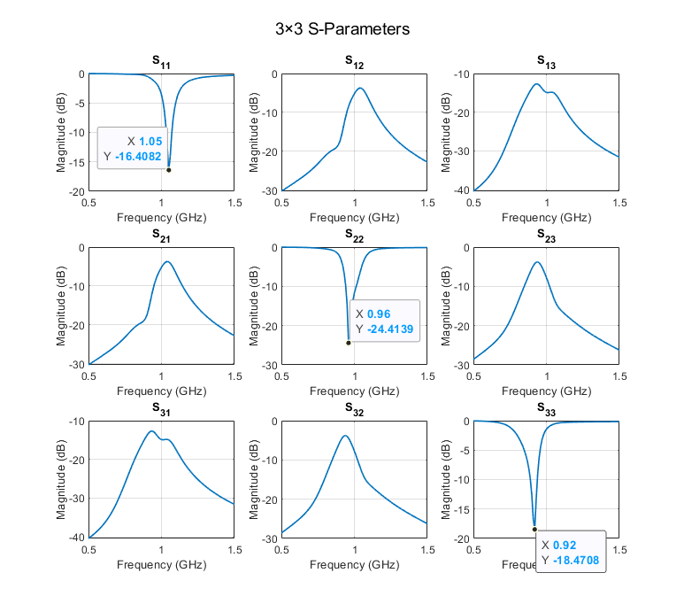
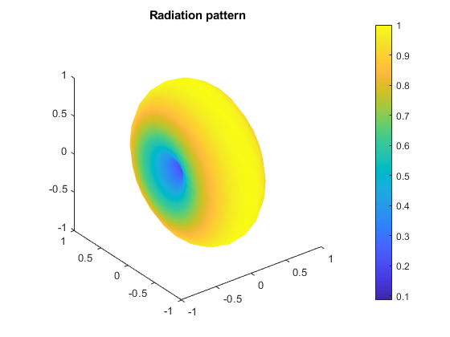

# Project 2
## Introduction
This project uses the Electric‐Field Integral Equation (EFIE) and a Method of Moments (MoM) solver to analyze a three‐element dipole array in free space. Each dipole is a thin PEC strip (lengths 130 mm, 150 mm, 165 mm; width 3 mm) driven by delta‐gap sources at its center. A triangular mesh and RWG basis functions represent the unknown surface currents, and specialized routines handle singular, near‐singular, and regular integrals to build the dense impedance matrix. Solving that matrix for each port excitation yields the multiport currents, from which the S‐parameter matrix is computed. Finally, the same currents are used to compute each dipole’s far‐field contribution and form the overall radiation pattern.
## Formulation of the Problem
### Strong Form of the EFIE on a PEC Surface
For PEC, the total tangential electric field must vanish on its surface $S$:

$$\begin{equation}
    \hat{\mathbf{n}}(\mathbf{r}) \times \mathbf{E}^\text{sca}(\mathbf{r})
    \;=\;
    -\,\hat{\mathbf{n}}(\mathbf{r}) \times \mathbf{E}^\text{inc}(\mathbf{r}),
\quad \mathbf{r}\in S
\end{equation}$$

since $\mathbf{E}^{tot} \;=\; \mathbf{E}^{sca} + \mathbf{E}^{inc} \;=\; 0$.

If the PEC surface carries an induced surface current $\mathbf{J}(\mathbf{r}^\prime)$, then the scattered field at a point $\mathbf{r}$(on or off the surface) can be wirtten as

$$\begin{equation}
    \begin{aligned}
        \mathbf{E}^\text{sca}(\mathbf{r})
        &=
        i\omega\,\mu_0 \int_{S} 
        G(\mathbf{r},\mathbf{r}')\,\mathbf{J}(\mathbf{r}') dS'\\
        &-\frac{1}{i\omega\,\varepsilon_0}\,
        \nabla \int_{S} 
        G(\mathbf{r},\mathbf{r}') \,\bigl[\nabla_{S}'\!\cdot \mathbf{J}(\mathbf{r}')\bigr]\,
        dS'
    \end{aligned}
\end{equation}$$

where $G(\mathbf{r},\mathbf{r}') \;=\; \frac{e^{\,i k\,|\mathbf{r}-\mathbf{r}'|}}{4\pi\,|\mathbf{r}-\mathbf{r}'|}$ and $k = \omega\sqrt{\mu_0\varepsilon_0}$.

In [(2)](#eq-2), the fiest term is the vector potential contribution $i \omega \mu_0 \int G \mathbf{J}$ and the second term is the scalar potential term $\nabla \int \mathbf{G} \left(\nabla_{S}^{\prime} \cdot \mathbf{J} \right) / \left( i \omega \epsilon_0 \right)$.

Substitute $\mathbf{r} \in S$ into [(2)](#eq-2) and inpose [(1)](#eq-1). Define the operator

$$\begin{equation}
    \begin{aligned}
        \mathcal{L}[\mathbf{J}](\mathbf{r}) &= i \omega \mu_0 \int_S G(\mathbf{r}, \mathbf{r}^\prime) \mathbf{J}(\mathbf{r}^\prime) dS^\prime\\
        &- \frac{1}{i \omega \epsilon_0} \nabla \int_S G(\mathbf{r}, \mathbf{r}^\prime) [\nabla_{S}^{\prime} \cdot \mathbf{J}(\mathbf{r}^\prime)] dS^\prime
    \end{aligned}
\end{equation}$$

Then for $\mathbf{r} \in S$, the PEC boundary condition becomes

$$\begin{equation}
    \hat{n}(\mathbf{r}) \times \mathcal{L}[\mathbf{J}](\mathbf{r}) = -\hat{n}(\mathbf{r}) \times \mathbf{E}^{inc}(\mathbf{r})
\end{equation}$$

which is the strong form of the EFIE on the PEC surface.

### Weak Form of the EFIE on a PEC Surface
We now expand the unknown surface current $\mathbf{J}(\mathbf{r}^\prime)$ in a finite set of $N_I$ RWG basis functions ${\mathbf{f}_n(\mathbf{r}^\prime)}$ supported on two adjacent triangles. Explicitly;

$$\begin{equation}
    \mathbf{J}(\mathbf{r}^\prime) = \sum_{n=1}^{N_I} J_n \mathbf{f}_n (\mathbf{r}^\prime), \; \mathbf{r}^\prime \in S
\end{equation}$$

where $J_n$ are the unknown complex coefficients to be solved. Insert this expansion into the operator $\mathcal{L}[\mathbf{J}]$.

To obtain a matrix equation, we enforce [(4)](#eq-4) in a weighted‐residual sense by taking the tangential inner product with each testing function $\mathbf{f}_m(\mathbf{r})$ and integrating over $S$ for each $m = 1, 2, \cdots, N_I$:

$$\begin{equation}
    \int_S \mathbf{f}_m(\mathbf{r}) \cdot [\hat{n}(\mathbf{r}) \times \mathcal{L}[\mathbf{J}](\mathbf{r})] dS(\mathbf{r}) = - \int_S \mathbf{f}_m(\mathbf{r}) \cdot [\hat{n}(\mathbf{r}) \times \mathbf{E}^{inc}(\mathbf{r})] dS(\mathbf{r})
\end{equation}$$

which is the weak form or the EFIE. Then we expand $\mathcal{L}[\mathbf{J}](\mathbf{r})$.

The first term is

$$\begin{equation}
    \begin{aligned}
        i \omega \mu_0 \int_S G(\mathbf{r}, \mathbf{r}^\prime) \mathbf{J}(\mathbf{r}^\prime) dS^\prime &= i \omega \mu_0 \int_S G(\mathbf{r}, \mathbf{r}^\prime) [\sum_{n=1}^{N_I} J_n \mathbf{f}_n (\mathbf{r}^\prime)] dS^\prime\\ &= \sum_{n=1}^{N_I} J_n [i \omega \mu_0 \int_S G(\mathbf{r}, \mathbf{r}^\prime) \mathbf{f}_n(\mathbf{r}^\prime) dS^\prime]
    \end{aligned}
\end{equation}$$

When we then compute $\hat{n}(\mathbf{r}) \times [\cdots]$, we have a double integral:

$$\begin{equation}
    \begin{aligned}
        I^{(1)}_{mn} &= i \omega \mu_0 \int_S \mathbf{f}_m(\mathbf{r}) \cdot [\hat{n}(\mathbf{r}) \times \int_S G(\mathbf{r}, \mathbf{r}^\prime) \mathbf{f}_n(\mathbf{r}^\prime) dS^\prime]dS(\mathbf{r})\\
        &= i \omega \mu_0 \int_S \int_S [\mathbf{f}_m(\mathbf{r}) \cdot (\hat{n}(\mathbf{r}) \times \mathbf{f}_n(\mathbf{r}^\prime))] G(\mathbf{r}, \mathbf{r}^\prime) dS^\prime dS
    \end{aligned}
\end{equation}$$

The second term is $-\frac{1}{i \omega \epsilon_0} \nabla \int_S G(\mathbf{r}, \mathbf{r}^\prime) [\nabla_{S}^{\prime} \cdot \mathbf{J}(\mathbf{r}^\prime)] dS^\prime$, its expansion is

$$\begin{equation}
    \begin{aligned}
        I_{mn}^{(2)} &= -\frac{1}{i \omega \epsilon_0} \nabla \sum_{n=1}^{N_I} J_n \int_S G(\mathbf{r}, \mathbf{r}^\prime) [\nabla_{S}^{\prime} \cdot \mathbf{f}_n(\mathbf{r}^\prime) dS^\prime]dS(\mathbf{r})\\
        &= -\frac{1}{i \omega \epsilon_0} \int_S \int_S [\mathbf{f}_m(\mathbf{r}) \cdot (\hat{n}(\mathbf{r}) \times \nabla G(\mathbf{r}, \mathbf{r}^\prime))][\nabla_{S}^{\prime} \cdot \mathbf{f}_n(\mathbf{r})] dS^\prime dS
    \end{aligned}
\end{equation}$$

and $A_{mn} = I^{(1)}_{mn} + I^{(2)}_{mn}$.

On the right-hand side of [(1)](#eq-1)

$$\begin{equation}
    b_m = - \int_S \mathbf{f}_m(\mathbf{r}) \cdot [\hat{n}(\mathbf{r}) \times \mathbf{E}^{inc}(\mathbf{r})] dS(\mathbf{r})
\end{equation}$$

### Physical Meaning
We have a EFIE system as

$$\begin{equation}
    \mathbf{A} \mathbf{J} = \mathbf{b}
\end{equation}$$

where $\mathbf{J} = [J_1, \cdots, J_{N_I}]^T$ are the RWG‐expansion coefficients of the unknown surface current.

#### Physical Meaning of $\mathbf{A}$
Each entry $A_{mn}$ is is a complex number that represents how a unit‐amplitude current on basis function $\mathbf{f}_n$ induces the tangential electric field seen by testing function $m$. Equivalently, if we feed a unit current $J_n = 1$ into RWG edge $n$ and zero into all other edges, then $A_{mn}$ tells us the tangential E-field projection across edge $m$.

Because Green function is oscillatory, $\mathbf{A}$ depends on frequency $f$. The matrix is full(no obvious sparsity), since every triangular patch interacts with every other via the Green’s function. Self-terms are singular in continuous integral, numerically we handle them with special routines,

In SI units, each element of $\mathbf{A}$ has dimensions of impedance (ohms).

#### Physical Meaning of $\mathbf{b}$
Each component $b_m$ measures how the given incident field $\mathbf{E}^{inc}$ induces the $m$-th RWG testing function. In effect, $\mathbf{E}^{inc}$ is known everywhere on the surface, then projecting $\mathbf{E}^{inc}$ onto $\hat{n} \times \mathbf{f}_m$ gives the net "driving voltage" on that edge. 

Since $\mathbf{E}^{inc}$ has units [V/m] and RWG function is dimensionless, the unit of $b_m$ is [V·m].

## Numerical Solution
### Matrix $\mathbf{A}$ Computation
To calculate $\mathbf{A}$ in our MoM implementation, the three quantities alok0, alok1, and alok2 appear as intermediate “coupling” matrices between two RWG basis functions.

#### alok0
alok0 is alok0 – the raw “triangle‐to‐triangle” Green’s‐function integral.

$$\begin{equation}
    \begin{aligned}
        alok0(i, j) &= \int_{T_P} \int_{T_Q} [\mathbf{v}_i^{P}(\mathbf{r}) \times \hat{n}_P(\mathbf{r})] \cdot G(\mathbf{r}, \mathbf{r}^\prime) \mathbf{v}_j^{Q}(\mathbf{r}^\prime) dS^\prime dS\\ 
        &- \frac{1}{k_0^2} \int_{T_P} \int_{T_Q} [\mathbf{v}_i^{P}(\mathbf{r}) \times \hat{n}_P(\mathbf{r})] \cdot \nabla G(\mathbf{r}, \mathbf{r}^\prime) \nabla_S^\prime \cdot \mathbf{v}_j^{Q}(\mathbf{r}^\prime) dS^\prime dS
    \end{aligned}
\end{equation}$$

where $\left\{ \mathbf{v}_i^P \right\}_{i=1}^3$ are the three local vector‐shape functions on triangle $T_P$ and $\left\{ \mathbf{v}_j^Q \right\}_{i=1}^3$ are the three local vector‐shape functions on triangle $T_Q$.

The first double integral $\int G \mathbf{v}_j dS^\prime dS$ is the “vector‐potential” (magnetic) contribution for each of the 3x3 pairs of local edges; the pairs of local edges $\int G [\nabla_S^\prime \cdot \mathbf{v}_j] dS^\prime dS$ is the “charge” (scalar‐potential) contribution.

#### alok1 and alok2
alok1 is the “vector‐potential” (magnetic) part and alok2 is the “scalar‐potential” (charge) part.

$$\begin{equation}
    \begin{aligned}
        alok1(i, j) &= \int_{T_P} \int_{T_Q} [\mathbf{v}_i^{P}(\mathbf{r}) \times \hat{n}_P(\mathbf{r})] \cdot G(\mathbf{r}, \mathbf{r}^\prime) \mathbf{v}_j^{Q}(\mathbf{r}^\prime) dS^\prime dS\\
        alok2(i, j) &= \frac{1}{k_0^2} \int_{T_P} \int_{T_Q} [\mathbf{v}_i^{P}(\mathbf{r}) \times \hat{n}_P(\mathbf{r})] \cdot \nabla G(\mathbf{r}, \mathbf{r}^\prime) \nabla_S^\prime \cdot \mathbf{v}_j^{Q}(\mathbf{r}^\prime) dS^\prime
    \end{aligned}
\end{equation}$$

alok1 and alok2 are the two separate pieces we need in order to build the final EFIE matrix entries and we can calculate them by separating alok0.

### Computation of S parameters
For a given frequency, we can calculate the matrix $\mathbf{A}$. Then we create excitation vectors $\mathbf{b}^{i}$ corresponding the delta gap excitation $V_i$. If we set the excitation value of 1, then $\mathbf{V}_i = \mathbf{b}^{i} \cdot width$. We can find soltion vector $\mathbf{J}$ by solving $\mathbf{A} \mathbf{J} = \mathbf{b}$. Then the input admittance matrix $\mathbf{Y}_{in}$ can be computed

$$\begin{equation}
    \mathbf{Y}_{in} = -\frac{1}{\mathbf{V}_i} (\mathbf{J}^{(i)})^T \mathbf{A} \mathbf{J}^{(i)}, \; i,j = 1,\cdots N_{port}
\end{equation}$$

and the S matrix is

$$\begin{equation}
    \mathbf{S} = (\mathbf{I} - Z_0 \mathbf{Y}_{in})(\mathbf{I} + Z_0 \mathbf{Y}_{in})^{-1}
\end{equation}$$

where $Z_0$ is the characteristic impedace and $Z_0 = 50$.

### Computation of Radiation Patterns
#### dlok
To compute the radiation pattern, we need to compute dlok. For a single triangle $T$ with vertices $p_1$, $p_2$ and $p_3$ and a given far‐field direction $\hat{r}$, we define

$$\begin{equation}
    dlok_j{\hat{r}} = \int_T e^{-i k \hat{r} \cdot r^\prime} \mathbf{v}_j^T(\mathbf{r}^\prime) dS^\prime, \; j = 1,\cdots N_{port}
\end{equation}$$

where $\mathbf{v}_j^l = - \hat{n} \times (N_i^l \nabla N_k^l - N_k^l \nabla N_i^l)$ and $(j ,i, k) = \left\{ (1, 1, 2), \; (2, 2, 3), \; (3, 3, 1) \right\}$.

Each local RWG shape $\mathbf{v}_j^T(\mathbf{r}^\prime)$ on triangle $T$ represents how a small “piece” of surface current would be distributed on that triangle. When we multiply $\mathbf{v}_j^T(\mathbf{r}^\prime)$ by the phase factor $e^{-i k \hat{r} \cdot r^\prime}$ and integrate over $T$, we obtain the equivalent radiation vector contributed by that local shape into the far field in direction $\hat{r}$.

After solving for the global RWG coefficients $\left\{ J_n \right\}$, we know that the total surface current is 

$$\begin{equation}
    \mathbf{J}(\mathbf{r}^\prime) = \int_T J_n \mathbf{f}_n(\mathbf{r}^\prime) dS^\prime
\end{equation}$$

where each global RWG $\mathbf{f}_n$ lives on two triangles. In the far‐field, the radiated electric field in direction $\hat{r}$ is given by summing, over every triangle $T$ and every local edge $j$ the product:

$$\begin{equation}
    coefficient \; on \; that \; edge \times dlok_j(\hat{r}) \times [\hat{r} \times (\hat{r} \times \cdot)]
\end{equation}$$

In short, we can use dlok to convert a given triangle's local current distribution to the radiated field in direction $\hat{r}$.

## Results
### Analytical Results
For a simple straight, center‐fed PEC dipole in free‐space, the first‐order (half‐wave) resonance occurs roughly when its total length $L$ is about half a wavelength:

$$\begin{equation}
    f_i \approx \frac{c_0}{2 L_i}
\end{equation}$$

So for these three dipoles their resonant frequencies should be 1.153GHz, 1GHz and 0.909GHz. Since their resonant frequencies are numerically close and there is some coupling among them, the total radiation patter should look like a wire antenna.

### Numerial Results
The S-paraters is shown below. We can see due to coupling, the lowest resonant frequency becomes higher and the highest resonant frequency becomes lower. 

At 0.96GHz, the radiation pattern is shown below. It looks similar to a wire antenna as expected.

## Conclusions
The EFIE‐MoM implementation accurately predicts both S‐parameters and far‐field patterns for the three closely spaced dipoles. The computed resonant frequencies closely match their nominal half‐wave lengths, adjusted for mutual coupling. The S‐matrix shows expected return‐loss minima at each dipole’s resonance, and the far‐field outputs reproduce the classic figure‐eight pattern when all ports are in phase. Introducing phase shifts among the ports successfully steers the combined radiation, verifying that this approach correctly captures both impedance and radiation behavior of the array.